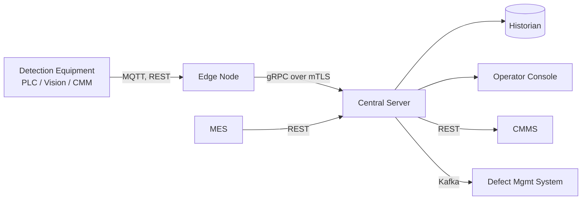

# 03. System Architecture

## 1. Architectural Overview

VDDEHMS is a three-tier distributed system:

1. **Edge Tier**: one Edge Node per inspection station, collocated with detection equipment
2. **Central Tier**: a Central Monitoring Server cluster in the plant data center
3. **Presentation and Integration Tier**: operator console, plus integrations with MES, CMMS, DMS, and the plant historian

## 2. Subsystem Decomposition

### 2.1 Edge Node

**Responsibilities**
- Telemetry ingestion from detection equipment
- Local buffering during loss of connectivity
- Edge analytics for low-latency anomaly detection
- Forwarding of telemetry and edge alerts to Central Server

**Implementation Considerations**
- Ruggedized industrial PC suitable for plant floor environments
- Deterministic networking to PLCs
- Local persistent buffer sized for at least one hour of telemetry at peak rate

### 2.2 Central Monitoring Server

**Responsibilities**
- Aggregation of telemetry across edge nodes
- Baseline maintenance and drift analytics
- Tiered alert generation and routing
- External system integration with CMMS, DMS, and MES
- Operator console backend API

**Implementation Considerations**
- High-availability deployment, three-node cluster minimum per plant
- Horizontal scalability for plants with high station counts
- Persistent message queue for downstream notifications to absorb backpressure

### 2.3 Historian

**Responsibilities**
- Long-term telemetry, alert, and calibration storage
- Query support for historical review scenarios

**Implementation Considerations**
- Time-series-optimized data store
- Partitioning by equipment and time for efficient range queries

### 2.4 Operator Console

**Responsibilities**
- Real-time equipment status display
- Alert workflow including acknowledge, defer, and close
- Calibration event entry
- Historical query user interface

**Implementation Considerations**
- Browser-based for plant floor terminal compatibility
- High-contrast color scheme for high-glare plant lighting
- Designed for both touch and keyboard input

### 2.5 External Integration Adapters

| Adapter | Pattern | Notes |
|---------|---------|-------|
| CMMS Adapter | REST client with persistent retry queue | Idempotent work order submission |
| DMS Adapter | Kafka producer | At-least-once delivery, consumer dedupes |
| MES Adapter | REST client and server | Pulls production context, exposes status |

## 3. Cross-Cutting Concerns

### 3.1 Identity and Access
- Central LDAP integration for operator console authentication
- Mutual TLS certificates for service-to-service authentication
- Role-based access control enforced at central API layer

### 3.2 Observability
- Structured logs, metrics, and traces emitted to plant IT observability stack
- Health endpoints on every component for active monitoring

### 3.3 Configuration
- Centralized configuration service
- Edge nodes pull configuration on connect and on change notification
- Threshold configuration auditable and versioned

## 4. Technical Risk Register

| ID | Risk | Likelihood | Impact | Mitigation |
|----|------|------------|--------|------------|
| R-01 | PLC telemetry rates exceed edge node capacity at peak | M | H | Edge sampling and back-pressure design; load test against worst-case line configuration |
| R-02 | False positive alerts erode operator trust | H | M | Tunable thresholds, Tier 1 vs Tier 2 separation, suppression rules for known noise sources |
| R-03 | CMMS work order queue saturated during line-wide event | L | H | Idempotent producer, dedupe by equipment plus root cause hash, rate limiting on adapter |
| R-04 | Plant network outage isolates edge from central | M | M | Edge local buffering, store-and-forward on reconnect, monitored buffer fill level |
| R-05 | Vision system vendor API change breaks ingestion | M | M | Adapter pattern, vendor version pinning, contract tests in CI |
| R-06 | Drift baseline mis-set after major calibration | L | M | Require explicit technician confirmation, baseline change auditable, reversible |
| R-07 | Cross-line load imbalance overloads single central node | L | M | Horizontal scaling, partitioning by line identifier |

## 5. Deployment View

| Tier | Footprint per Plant |
|------|---------------------|
| Edge Nodes | 30 to 100, one per inspection station |
| Central Servers | 3-node high-availability cluster |
| Operator Console | Served from central, accessed from plant floor terminals and engineering workstations |
| Historian | Co-located with central tier, separately scaled |

## 6. Architectural Decisions

| Decision | Rationale |
|----------|-----------|
| Edge plus central rather than pure central | Reduce latency for Tier 3 alerts, provide network outage resilience |
| MQTT for PLC ingestion | Industry standard for industrial telemetry, supports QoS levels and TLS |
| Kafka for DMS re-inspection flags | Durable, ordered per-key delivery aligns with quality system replay needs |
| Advisory only, no closed-loop control | Reduces safety analysis scope and regulatory exposure |
